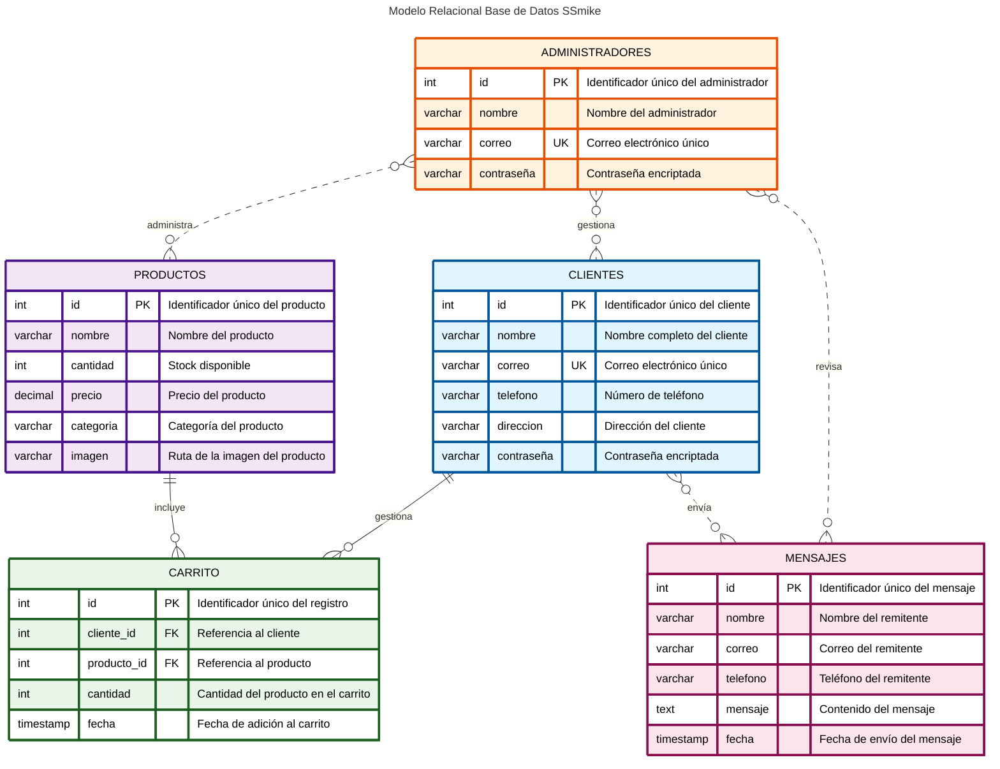

# Diagrama Modelo Relacional - Base de Datos SSmike

## Descripción
Este diagrama muestra la estructura y relaciones de la base de datos SSmike, un sistema de e-commerce para productos de belleza y cosmética.

## Descripción de las Entidades

### CLIENTES
- **Propósito**: Almacena información de los usuarios registrados en el sistema
- **Características**: 
  - Cada cliente tiene un ID único autoincremental
  - El correo electrónico es único (constraint UNIQUE)
  - Las contraseñas se almacenan encriptadas

### PRODUCTOS
- **Propósito**: Catálogo completo de productos disponibles en la tienda
- **Categorías disponibles**:
  - Maquillaje (bases, labiales, sombras, etc.)
  - Skincare (limpiadores, cremas, sueros, etc.)
  - Fragancias (perfumes y eau de parfum)
  - Accesorios (brochas, esponjas, herramientas)
- **Características**:
  - Control de inventario mediante el campo `cantidad`
  - Precios con precisión decimal
  - Imágenes almacenadas como rutas de archivo

### CARRITO
- **Propósito**: Gestiona los productos que los clientes agregan antes de realizar la compra
- **Características**:
  - Relación muchos a muchos entre clientes y productos
  - Cada registro incluye la cantidad específica
  - Timestamp para rastrear cuándo se agregó cada producto
  - Cascada en eliminación (si se elimina cliente o producto, se eliminan sus registros del carrito)

### ADMINISTRADORES
- **Propósito**: Gestión de usuarios con privilegios administrativos
- **Características**:
  - Sistema de autenticación separado de los clientes
  - Correo único para evitar duplicados
  - Contraseñas encriptadas para seguridad

### MENSAJES
- **Propósito**: Sistema de contacto para comunicación con la empresa
- **Características**:
  - No requiere registro previo
  - Almacena datos de contacto del remitente
  - Timestamp automático para organización cronológica

## Relaciones del Sistema

### Relaciones Principales (Identificativas)
1. **CLIENTES → CARRITO** (1:N)
   - Un cliente puede tener múltiples productos en su carrito
   - Relación identificativa con eliminación en cascada

2. **PRODUCTOS → CARRITO** (1:N)
   - Un producto puede estar en múltiples carritos
   - Relación identificativa con eliminación en cascada

### Relaciones Conceptuales (No Identificativas)
3. **ADMINISTRADORES → PRODUCTOS** (N:M)
   - Los administradores gestionan el catálogo de productos
   - Pueden crear, editar y eliminar productos

4. **ADMINISTRADORES → CLIENTES** (N:M)
   - Los administradores supervisan las cuentas de clientes
   - Pueden gestionar usuarios y resolver incidencias

5. **ADMINISTRADORES → MENSAJES** (N:M)
   - Los administradores revisan y responden mensajes
   - Sistema de atención al cliente

6. **CLIENTES → MENSAJES** (N:M)
   - Los clientes pueden enviar múltiples mensajes de contacto
   - No requiere autenticación, es un sistema abierto

## Características del Sistema

- **Seguridad**: Contraseñas encriptadas con hash
- **Integridad referencial**: Claves foráneas con restricciones CASCADE
- **Escalabilidad**: Diseño preparado para crecimiento del catálogo
- **Trazabilidad**: Timestamps en operaciones críticas
- **Flexibilidad**: Estructura que permite futuras extensiones